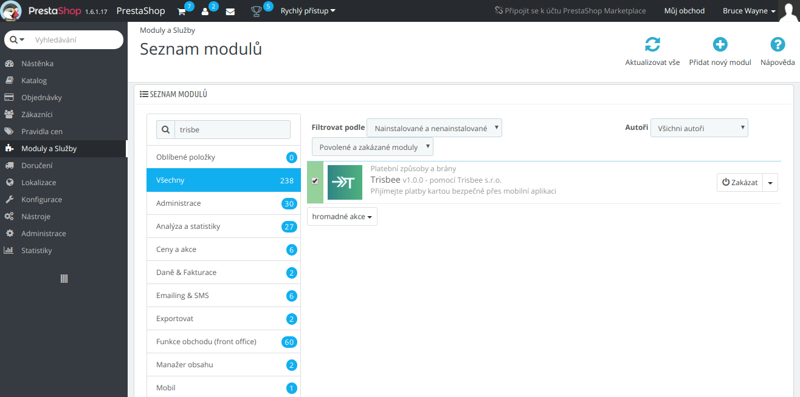
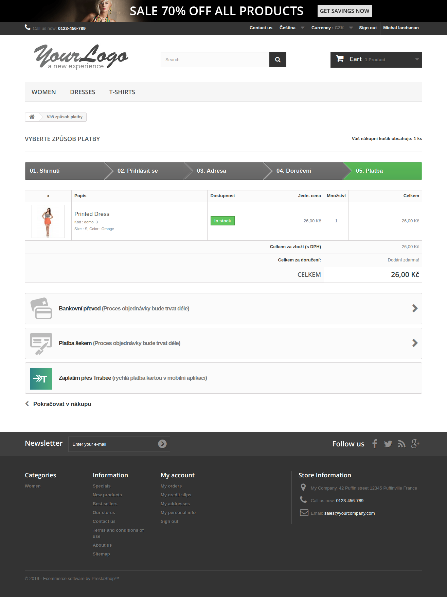
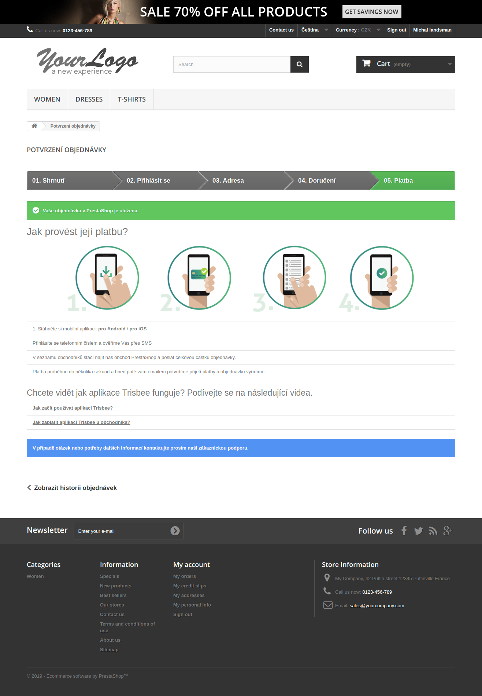

# Prestashop

Modul pro platby kartou s využitím mobilní aplikace [Trisbee](https://www.trisbee.com/#zakaznik).

Testováno na verzi Prestashop: `1.6.1.17` s tématem `default-boostrap`.

# Instalace

1. stáhněte si poslední verzi pluginu v [releases](https://github.com/trisbee/prestashop/releases) - pojmenována vždy `module.zip`.
2. v administraci eshopu kliněte v menu na: `Moduly a Služby` -> `Přidat nový modul` -> `Vybrat soubor` -> `Nahrát tento modul`.
3. modul je připraven

# Preview

